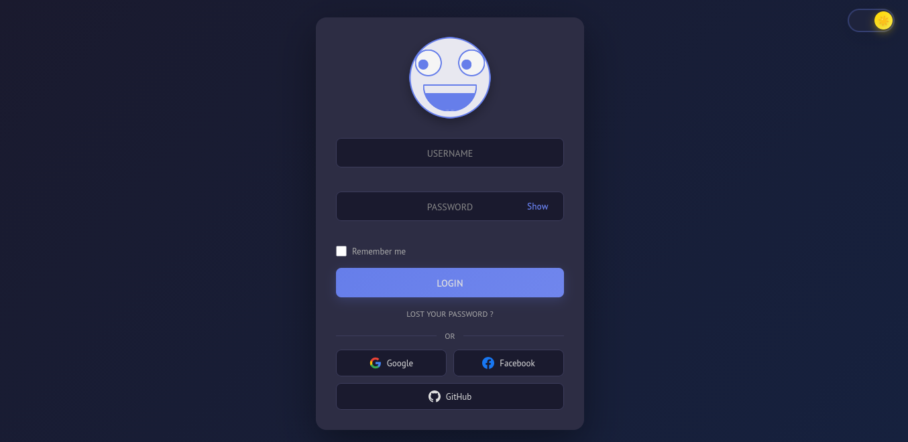
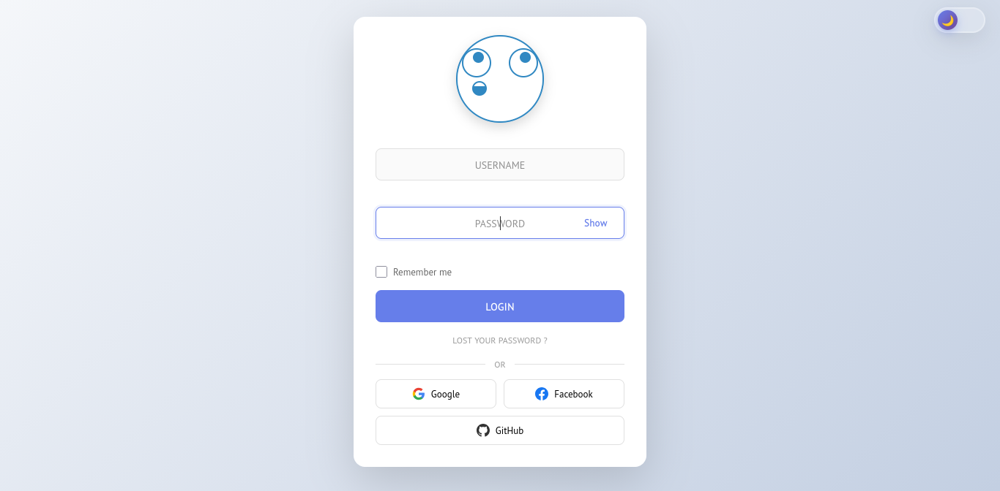

# Interactive Login Page with Animated Character

A modern, interactive login page featuring an animated character that responds to user interactions. Built with vanilla JavaScript, modular CSS, and smooth animations.






## ✨ Features

### 🎭 Character Animations
- **Mouse Tracking**
- **Input Reactions** 
- **Password Privacy** 
- **Show/Hide Password** 
- **Success Animation** 
- **Error Animation** 
- **Loading State** 
- **Idle Behaviors**
- **Theme Toggle Reaction** 
- **Entrance Animation** 

### 🎨 User Interface
- **Dark/Light Theme** - Glass liquid toggle
- **Responsive Design** 
- **Smooth Animations** 

## 🚀 Getting Started

### Prerequisites
- A modern web browser
- Python 3 (for local server) or any HTTP server

### Installation

1. **Clone or download the project**
   ```bash
   cd /path/to/login
   ```

2. **Start a local server**
   ```bash
   python3 -m http.server 8001
   ```
   
   Or use any other HTTP server of your choice.

3. **Open in browser**
   ```
   http://localhost:8001/index.html
   ```

### Test Credentials

Any other combination will show an error message.

## 📁 Project Structure

```
login/
├── index.html              # Main HTML file
├── README.md               # Project documentation
├── js/
│   ├── main.js            # Main application logic
│   ├── character.js       # Character animation functions
│   ├── auth.js            # Authentication & validation
│   └── theme.js           # Theme management
├── styles/
│   ├── main.css           # CSS imports
│   ├── base.css           # Reset & body styles
│   ├── theme.css          # Theme toggle styles
│   ├── form.css           # Login form styles
│   ├── character.css      # Character animations
│   ├── social.css         # Social login buttons
│   └── responsive.css     # Mobile responsive styles
├── audio/
│   ├── whistle.wav        # Whistling sound
│   ├── wink.wav           # Blinking sound
│   └── rotation.wav       # Head rotation sound
└── images/
    └── calfc.png          # Favicon
    └── img1.png           # preview 1
    └── img2.png           # preview 3
    └── img3.png           # preview 2
```


## 🛠️ tools Used

- **HTML5** 
- **CSS3**
- **JavaScript (ES6 Modules)** 
- **SVG**
- **Web Audio API** 

## 🎨 Customization

### Change Colors
Edit `styles/theme.css` and `styles/form.css` to customize the color scheme.

### Modify Character
Edit `index.html` (SVG markup) and `styles/character.css` for character appearance and animations.

### Add More Animations
Extend `character.js` with new animation functions and trigger them from `main.js`.

### Change Credentials
Edit the `checkCredentials` function in `auth.js` to change or add authentication logic.


## 🔊 Audio

The page includes optional sound effects:
- Whistling when password field is focused
- Winking sound during blinks
- Rotation sound when head spins

Audio volume is set to 20% by default and can be adjusted in `character.js`.


## 📝 License

This project is open source and available for personal and commercial use.

## 🤝 Contributing

Feel free to fork this project and customize it for your needs!

## 📧 Support

For issues or questions, please check the code comments or modify as needed for your use case.

---

**Enjoy your interactive login page!** 🎉
