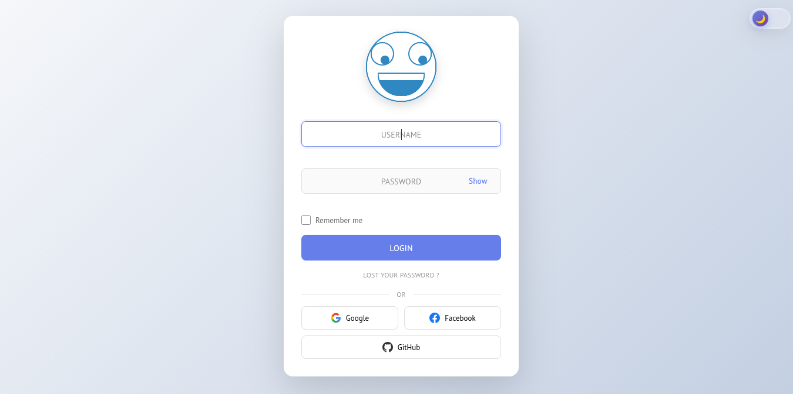

# Interactive Login Page with Animated Character

A modern, interactive login page featuring an animated character that responds to user interactions. Built with vanilla JavaScript, modular CSS, and smooth animations.


(images/img3.png)

## ✨ Features

### 🎭 Character Animations
- **Mouse Tracking** - Eyes follow your cursor around the screen
- **Input Reactions** - Character looks down when typing username
- **Password Privacy** - Character whistles and looks away when password field is focused
- **Show/Hide Password** - Character peeks when password is visible
- **Success Animation** - Happy face with sparkling eyes and bounce on successful login
- **Error Animation** - Sad face with head shake on failed login
- **Loading State** - Thoughtful expression while processing login
- **Idle Behaviors** - Random blinking and head rotations
- **Theme Toggle Reaction** - Character blinks when switching themes
- **Entrance Animation** - Character slides up and fades in on page load

### 🎨 User Interface
- **Dark/Light Theme** - Glass liquid toggle switch with smooth transitions
- **Form Validation** - Real-time error messages for empty fields
- **Remember Me** - Checkbox to save username for next visit
- **Social Login Buttons** - Google, Facebook, and GitHub options
- **Responsive Design** - Optimized for desktop, tablet, and mobile
- **Smooth Animations** - Professional transitions and effects throughout

### 🔐 Authentication
- **Form Validation** - Checks for empty username and password
- **Login Logic** - Demo authentication system
- **Error Handling** - Clear error messages for incorrect credentials
- **Loading State** - Visual feedback during login process

## 🚀 Getting Started

### Prerequisites
- A modern web browser (Chrome, Firefox, Safari, Edge)
- Python 3 (for local server) or any HTTP server

### Installation

1. **Clone or download the project**
   ```bash
   cd /path/to/login
   ```

2. **Start a local server**
   ```bash
   python3 -m http.server 8001
   ```
   
   Or use any other HTTP server of your choice.

3. **Open in browser**
   ```
   http://localhost:8001/index.html
   ```

### Test Credentials

For demo purposes, use these credentials:
- **Username:** `admin`
- **Password:** `password`

Any other combination will show an error message.

## 📁 Project Structure

```
login/
├── index.html              # Main HTML file
├── README.md               # Project documentation
├── js/
│   ├── main.js            # Main application logic
│   ├── character.js       # Character animation functions
│   ├── auth.js            # Authentication & validation
│   └── theme.js           # Theme management
├── styles/
│   ├── main.css           # CSS imports
│   ├── base.css           # Reset & body styles
│   ├── theme.css          # Theme toggle styles
│   ├── form.css           # Login form styles
│   ├── character.css      # Character animations
│   ├── social.css         # Social login buttons
│   └── responsive.css     # Mobile responsive styles
├── audio/
│   ├── whistle.wav        # Whistling sound
│   ├── wink.wav           # Blinking sound
│   └── rotation.wav       # Head rotation sound
└── images/
    └── calfc.png          # Favicon
```

## 🎮 How to Use

1. **Type in the username field** - Character looks down at your typing
2. **Move to password field** - Character whistles and looks away
3. **Click "Show" button** - Character peeks at the password
4. **Move your mouse** - Eyes follow your cursor (when not typing)
5. **Click LOGIN** - Character thinks, then shows happy or sad face
6. **Toggle theme** - Switch between light and dark mode
7. **Check "Remember me"** - Username will be saved for next visit

## 🛠️ Technologies Used

- **HTML5** - Semantic markup
- **CSS3** - Modern styling with animations
- **JavaScript (ES6 Modules)** - Modular, organized code
- **SVG** - Hand-drawn character graphics
- **Web Audio API** - Sound effects

## 🎨 Customization

### Change Colors
Edit `styles/theme.css` and `styles/form.css` to customize the color scheme.

### Modify Character
Edit `index.html` (SVG markup) and `styles/character.css` for character appearance and animations.

### Add More Animations
Extend `character.js` with new animation functions and trigger them from `main.js`.

### Change Credentials
Edit the `checkCredentials` function in `auth.js` to change or add authentication logic.

## 📱 Browser Support

- Chrome/Edge (latest)
- Firefox (latest)
- Safari (latest)
- Mobile browsers (iOS Safari, Chrome Mobile)

## 🔊 Audio

The page includes optional sound effects:
- Whistling when password field is focused
- Winking sound during blinks
- Rotation sound when head spins

Audio volume is set to 20% by default and can be adjusted in `character.js`.

## 🌐 Features Breakdown

### Form Features
- Real-time validation
- Error state styling
- Loading spinner
- Password visibility toggle
- Remember me functionality
- Enter key navigation

### Character States
- **Neutral** - Default resting state
- **Looking Down** - When typing username
- **Whistling** - When password field is focused
- **Peeking** - When password is visible
- **Thinking** - During login process
- **Happy** - On successful login
- **Sad** - On failed login
- **Blinking** - Random idle animation

## 📝 License

This project is open source and available for personal and commercial use.

## 🤝 Contributing

Feel free to fork this project and customize it for your needs!

## 📧 Support

For issues or questions, please check the code comments or modify as needed for your use case.

---

**Enjoy your interactive login page!** 🎉
